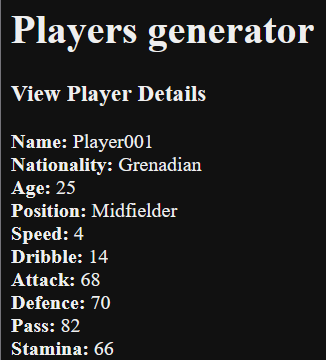

# Players Generator app
### Docker Database generation steps
Make a Docker container
```
$ docker container run -d -it --name players-mysql-server -e MYSQL_ROOT_PASSWORD=admin -p 3306:3306 mysql
```
Database credentials:
username: root
password: admin

Connect to database
```
mysql -h localhost -P 3306 --protocol=tcp -u admin -p
```

Generate database
```
create database playerDb;
```

In console:
```
create user 'root'@'%' identified by 'admin';
grant all privileges on playerDb.* to 'root'@'%';
flush privileges;
```

### Run application
Run docker container, Spring-Boot, and Angular.
Backend runs on ```http://localhost:8080```<br>
Frontend runs on ```http://localhost:4200```

Main page has list of players in DB and looks like this<br>
<br>

For each player, interaction with data is available in 3 different ways:
1. Update
2. Delete
3. View

#### Update
Modify name field.

#### Delete
Remove player from player list (delete database entity).

#### View
See player details and stats.
<br>

Add new player<br>
<br>

Don't you dare leaving name field blank or using a name that exists in the database<br>
<br>
